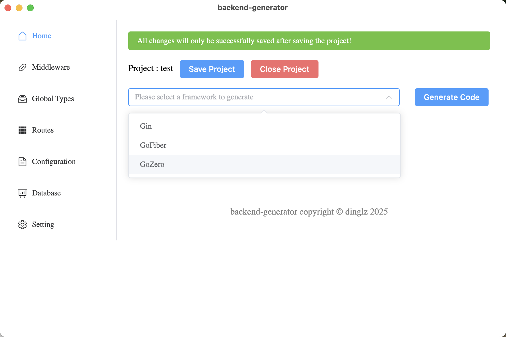
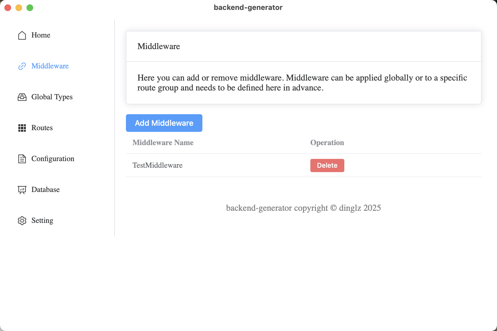

# Backend-generator

[中文版文档](README_zh.md)

## Introduction

Backend-generator is a tool that helps developers quickly generate backend code for specific Go web frameworks through a visual UI to set up and define project structures (such as middleware, routes including paths and request/response bodies, etc.). It aims to improve development speed and efficiency while reducing repetitive work.

## Features

- Supports various Go web frameworks.
- Easy to configure and extend.
- Generates backend code templates.
- Increases development speed and efficiency.
- Supports generating database code, such as gorm.
- Simple and intuitive visual UI interface.
- Support multiple languages, such as Chinese, English, and Japanese.
- Support for one-click generation of API documentation.

## Supported Frameworks

### Web

- gin
- go-fiber (TODO)
- ... (more frameworks in progress)

### Database

- gorm (TODO)
- ... (more databases in progress)

## Usage

1. Create a new folder and open it with backend-generator. BG will generate a `bg.json` file based on your settings in the UI and save it in this folder.
2. Configure routes and other settings.
3. Choose your preferred web framework and generate the corresponding code.
4. Implement the corresponding middleware in the `middleware` folder and the routes in the `route` folder to efficiently develop a RESTful API application.

## Run

You can also directly download and use the executable file from the release.

This project is developed based on Wails. Please install [Wails-cli](https://wails.io/docs/gettingstarted/installation) before running.

```bash
wails dev
```

## Showcase

Some UI screenshots are as follows:






## Contribution

We welcome community contributions!

A web framework generator only needs to follow the interface in `generator/common/generator.go`. Refer to `generator/gin` (the generator for the gin framework) and `generate.go` (the calling process) for implementation details.

We look forward to seeing more possibilities, not just Go web frameworks, but also Java's Spring, C++'s Dragon, and more.

## License

This project is licensed under the MIT License.