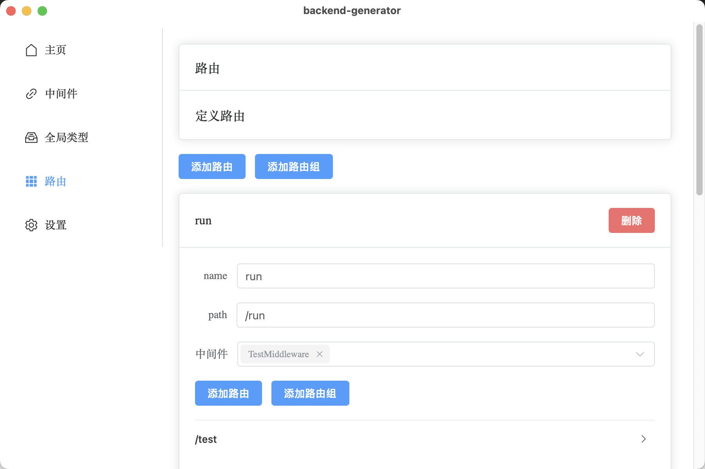
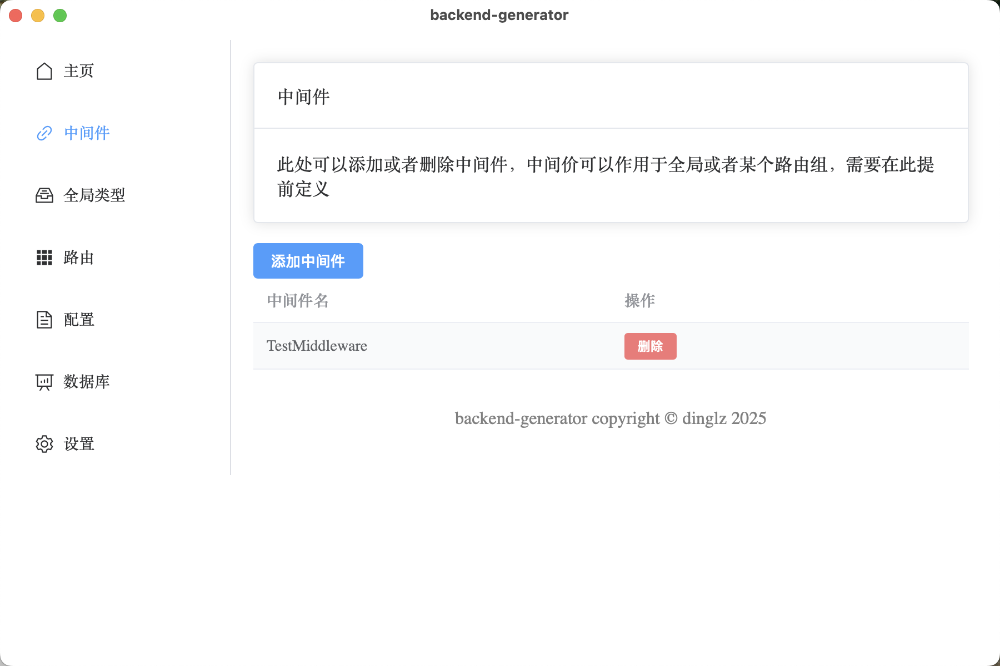

# Backend-generator

[English Documentation](README.md)

## 介绍

backend-generator是一款帮助开发者通过可视化UI对项目结构进行设置、定义（如中间件，路由（包括path和请求体响应体等）），快速生成特定 Go web 框架后端代码的工具。它旨在提高开发速度和效率，减少重复劳动。

## 特性

- 支持各种 Go web 框架
- 易于配置和扩展
- 生成后端代码样板
- 提高开发速度和效率
- 支持生成数据库代码，例如gorm
- 可视化UI界面，操作简单直观
- 支持多语言，如中文，英语，日语

## 目前支持框架

### Web

- gin
- go-fiber (TODO)
- ...（更多框架支持中）

### Database

- gorm (TODO)
- ...（更多数据库支持中）

## 使用

1. 新建一个文件夹，用backend-generator打开。bg会根据你在UI中的设置为你生成bg.json并保存在这个文件夹下。
2. 对路由等进行设置。
3. 选择喜欢的web框架，生成对应的代码。
4. 在middleware文件夹中实现对应的middleware，在route文件夹里实现对应的route，即可高效地开发出一个RESTful API的应用。

## 运行

本项目基于wails开发，运行前请先安装[Wails-cli](https://wails.io/docs/gettingstarted/installation)。

也可直接下载release中的可执行文件使用

```bash
wails dev
```

## 展示

部分UI如下：





## 贡献

我们欢迎社区的贡献！

一个web框架的生成器只需要遵从generator/common/generator.go的接口即可。实现过程可参考generator/gin（gin框架的生成器）和generate.go（调用流程）。

我们期待看到更多可能性，不只是Go的web框架，甚至是Java的Spring，C++的Dragon等等。

## 许可证

该项目是根据 MIT 许可证授权的。