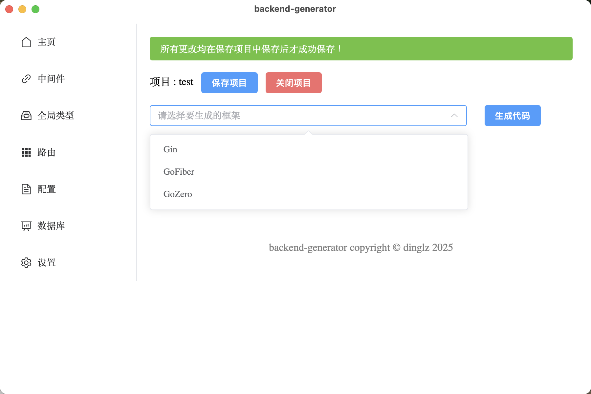

# Backend-generator

[English Documentation](README.md)

## 介绍

backend-generator是一款帮助开发者通过可视化ui对项目结构进行设置、定义（如中间件，路由（包括path和请求体响应体等））快速生成特定 Go web 框架后端代码的工具。目标是让开发者专注于业务逻辑，无需考虑结构问题，并不需要进行重复性工作，快速开发一些小项目。

## 特性

- 支持各种 Go web 框架
- 易于配置和扩展
- 生成后端代码样板
- 提高开发速度和效率
- 支持生成数据库代码，例如gorm

## 目前支持框架

### web

- gin

- go-fiber (TODO)

- ...

### database

- gorm (TODO)

## 使用

1. 新建一个文件夹，用backend-generator打开，bg会根据你在ui中的设置为你生成bg.json并保存在这个文件夹下

2. 对路由等进行设置

3. 选择喜欢的web框架，生成对应的代码

4. 在middleware文件夹中实现对应的middleware，在route文件夹里实现对应的route，即可高效地开发出一个restful-api的应用

## 构建

本项目基于wails开发，构建前请先安装[Wails-cli](https://wails.io/docs/gettingstarted/installation)

## 展示

部分ui如下

## 贡献

我们欢迎社区的贡献

一个web框架的生成器只需要遵从generator/common/generator.go的接口即可，实现过程可参考generator/gin（gin框架的生成器）和generate.go（调用流程）

我们期待看到更多可能性，不只是go的web框架，甚至是java的spring，cpp的dragon等等

## 许可证

该项目是根据 MIT 许可证授权的。